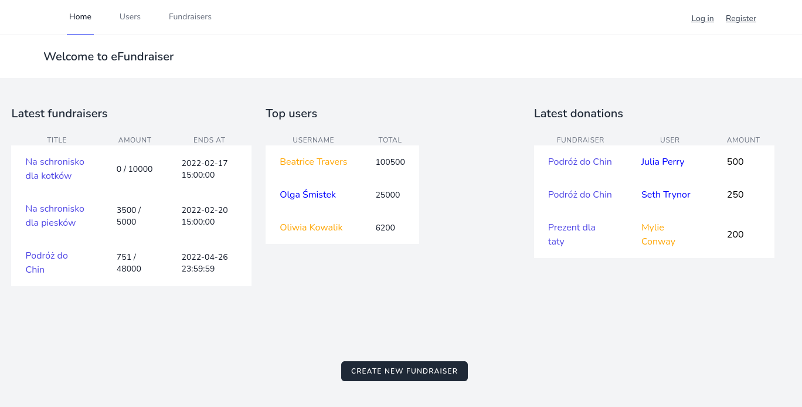
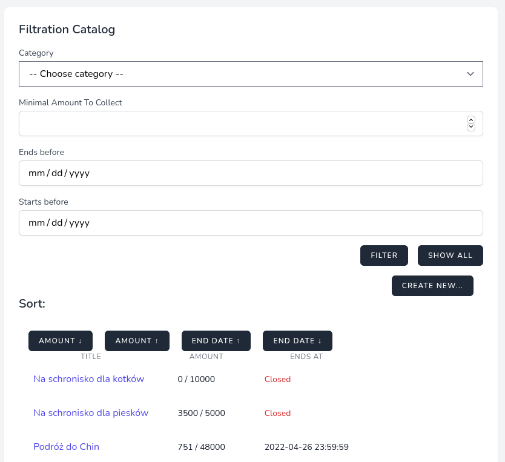
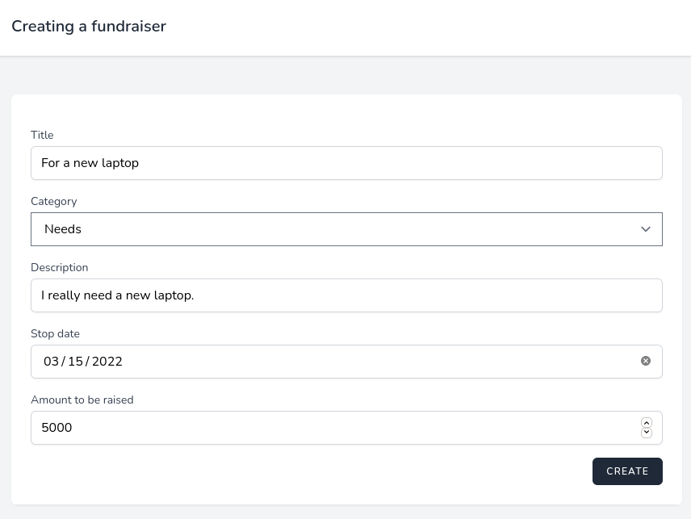
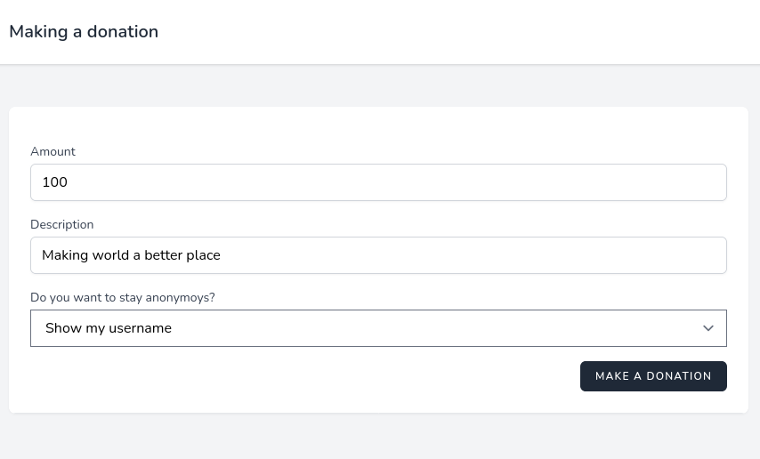
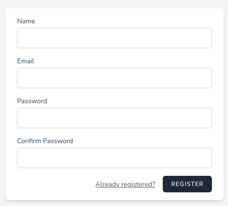

# eFundraiser
Web application for creating and donating online fundraisers.
### Description
The home page contains lately created fundraisers, latest
donations and top users. Guests can browse all open fundraisers 
and their donations. They can also see users ranking, where users 
are ordered by total amount of donations. Every fundraiser contains
information like category, description, current and target amount,
latest donations. List of fundraisers can be filtered and sorted. 
Most active users in current week have their username in gold.

To make a donation you have to sign up, then you can choose if you
want to stay anonymous or share your username. To create a new fundraiser
you have to be a verified user.

Original version was developed using PHP and Laravel framework. 
Then the app was refactored with Django and all upcoming updates
will be pushed to this repository. You can see original code here:
[Bitbucket repository](https://bitbucket.org/kzarnowski/php_2021_przeprowadzanie_zbiorek_pienieznych_online/src/master/)

###Screenshots:

Home page:

Fundraisers list:

Create a new fundraiser:

Make a donation:

Sign up:

